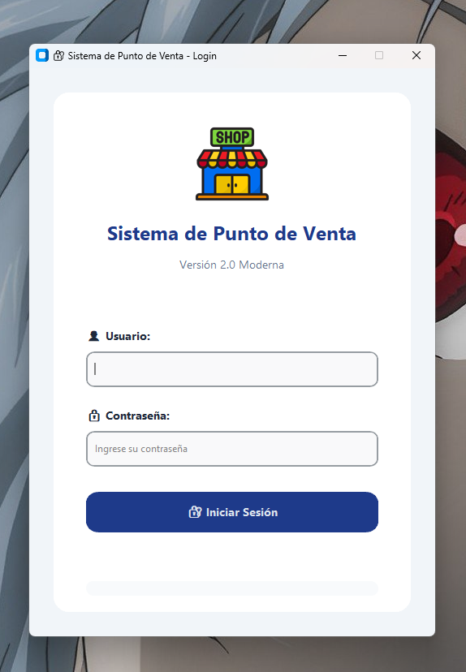
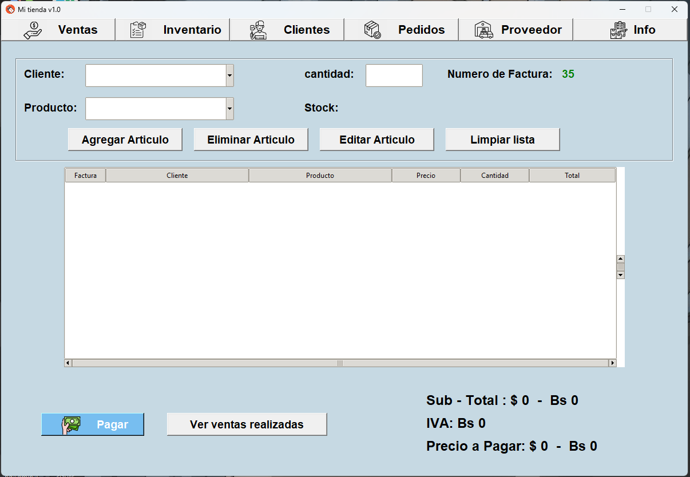
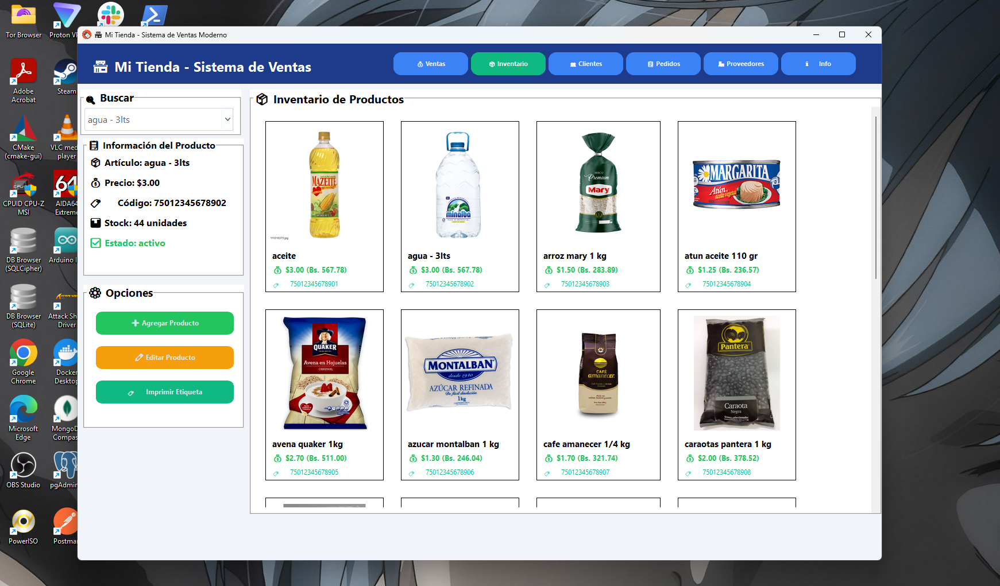
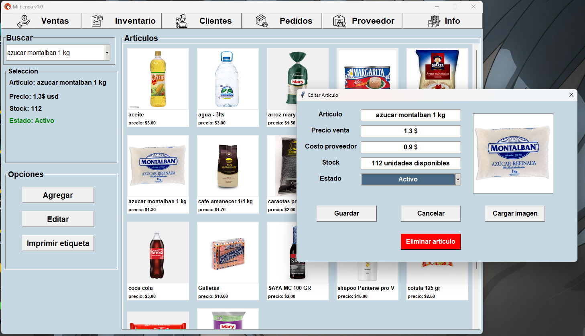
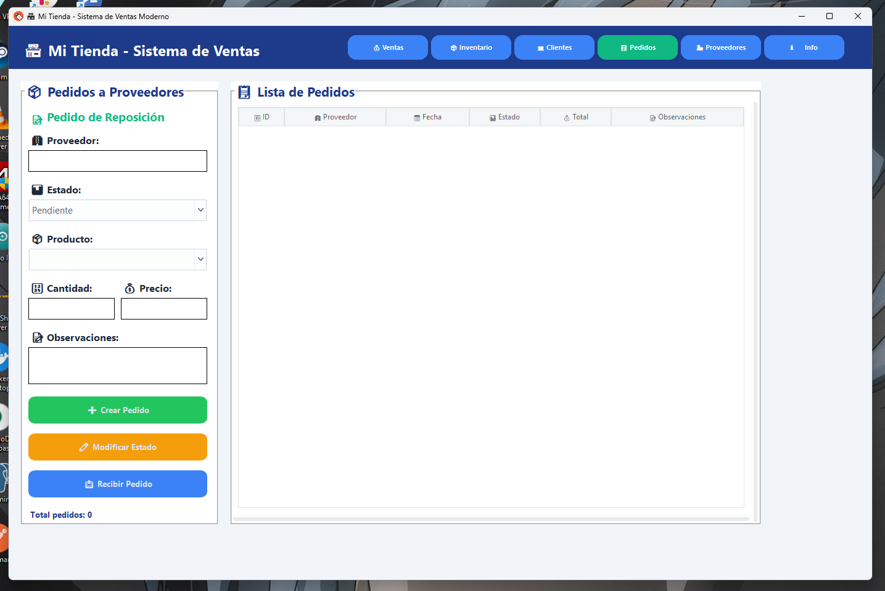
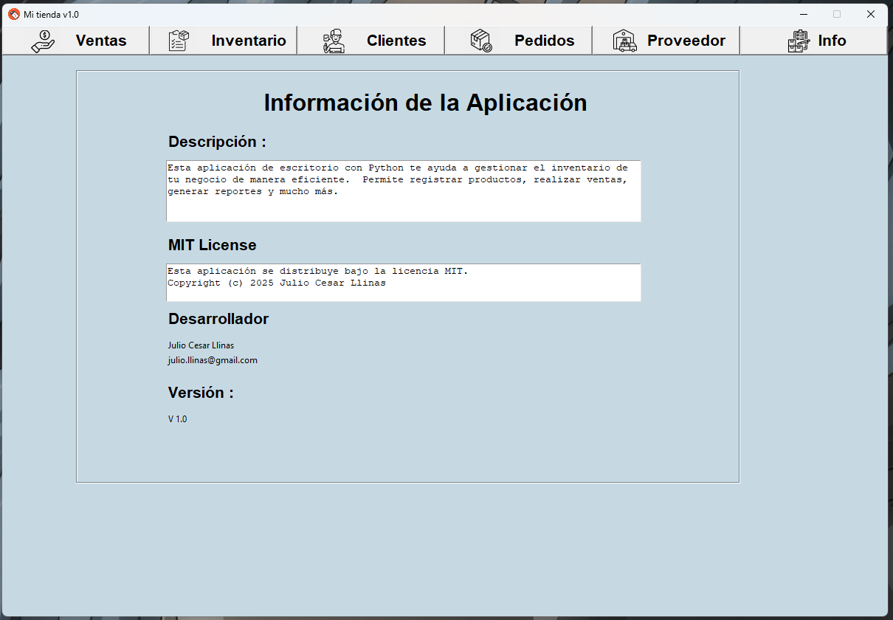

# 🏪 Sistema de Punto de Venta Moderno








## 📋 Descripción

Sistema de punto de venta (POS) desarrollado en Python con interfaz gráfica moderna utilizando Tkinter y CustomTkinter. Permite gestionar de forma completa el inventario, realizar ventas, administrar clientes, manejar pedidos a proveedores y generar reportes detallados.

### ✨ Características Principales

- **💰 Gestión de Ventas**: Registro de ventas con cálculo automático, generación de facturas y códigos QR
- **📦 Control de Inventario**: Gestión completa de productos con código de barras, stock, precios y costos
- **👥 Administración de Clientes**: Registro y gestión de información de clientes
- **📦 Pedidos a Proveedores**: Sistema para gestionar pedidos y órdenes de compra
- **🏢 Gestión de Proveedores**: Administración de información de proveedores
- **📊 Reportes y Estadísticas**: Dashboard con información detallada del negocio
- **📜 Historial de Actividades**: Registro completo de todas las operaciones del sistema
- **🔐 Sistema de Autenticación**: Control de acceso con usuarios y contraseñas
- **🎨 Interfaz Moderna**: Diseño actualizado con Material Design

---

## 🚀 Instalación

### Requisitos Previos

- Python 3.10 o superior
- pip (gestor de paquetes de Python)
- PowerShell (Windows) o Terminal (Linux/Mac)

### Pasos de Instalación

#### 1. Clonar o descargar el repositorio

```bash
git clone https://github.com/jhonshua/Python-Tkinter.git
cd "punto de venta 2"
```

O simplemente navega a la carpeta del proyecto si ya lo tienes descargado.

#### 2. Crear un entorno virtual (Recomendado)

**En Windows (PowerShell):**
```powershell
py -3.10 -m venv env
```

**En Linux/Mac:**
```bash
python3 -m venv env
```

#### 3. Activar el entorno virtual

**En Windows (PowerShell):**
```powershell
.\env\Scripts\Activate.ps1
```

Si aparece un error de política de ejecución:
```powershell
Set-ExecutionPolicy -ExecutionPolicy RemoteSigned -Scope CurrentUser
```

**En Windows (CMD):**
```cmd
.\env\Scripts\activate.bat
```

**En Linux/Mac:**
```bash
source env/bin/activate
```

#### 4. Instalar dependencias

```bash
pip install --upgrade pip
pip install -r requirements.txt
```

#### 5. Crear usuario administrador (Primera vez)

```bash
python crear_admin.py
```

Esto creará un usuario administrador con:
- **Usuario**: `admin`
- **Contraseña**: `admin123`

⚠️ **Importante**: Cambia la contraseña después del primer inicio de sesión por seguridad.

---

## 🏃 Ejecución

Una vez completada la instalación, puedes ejecutar el sistema de dos formas:

### Opción 1: Usando manager.py (Recomendado)

```bash
python manager.py
```

### Opción 2: Usando index.py

```bash
python index.py
```

El sistema iniciará mostrando primero la pantalla de login. Ingresa las credenciales del administrador para acceder al sistema principal.

---

## 📁 Estructura del Proyecto

```
punto de venta 2/
│
├── 📂 data/                          # Modelos y base de datos
│   ├── models.py                     # Modelos de base de datos
│   └── database.db                   # Base de datos SQLite (se crea automáticamente)
│
├── 📂 media/                         # Recursos multimedia
│   ├── icons/                        # Iconos de la aplicación
│   │   ├── mi_tienda.ico             # Icono principal
│   │   ├── venta_icon.png            # Iconos de módulos
│   │   └── ...
│   └── img/                          # Imágenes
│       ├── img_productos/            # Imágenes de productos
│       └── fondo.png                 # Fondo de la aplicación
│
├── 📂 modulos/                       # Módulos principales del sistema
│   ├── 📂 auth/                      # Autenticación
│   │   └── login.py
│   │
│   ├── 📂 ventas/                    # Módulo de ventas
│   │   ├── ventas_moderna.py         # Interfaz moderna de ventas
│   │   ├── crear_factura.py          # Generación de facturas
│   │   └── obtener_numero_factura.py # Gestión de números de factura
│   │
│   ├── 📂 inventario/                # Gestión de inventario
│   │   ├── inventario_simple.py      # Interfaz de inventario
│   │   └── inventario_moderno.py     # Versión moderna
│   │
│   ├── 📂 clientes_moderno.py        # Gestión de clientes
│   ├── 📂 pedidos_moderno.py         # Pedidos a proveedores
│   │
│   ├── 📂 proveedores/               # Gestión de proveedores
│   │   └── proveedor_moderno.py
│   │
│   ├── 📂 informacion/               # Dashboard e información
│   │   └── informacion_moderna.py
│   │
│   ├── 📂 historial/                 # Historial de actividades
│   │   └── gestor_historial.py
│   │
│   ├── 📂 configuracion/             # Configuración del sistema
│   │   └── gestor_configuracion.py
│   │
│   ├── 📂 reportes/                  # Generación de reportes
│   │   └── generador_reportes.py
│   │
│   └── 📂 utils/                      # Utilidades y estilos
│       ├── estilos_modernos.py       # Estilos y temas
│       ├── switch_moneda.py          # Conversión de monedas
│       └── utils.py                  # Funciones auxiliares
│
├── 📄 manager.py                     # Punto de entrada principal
├── 📄 index.py                       # Punto de entrada alternativo
├── 📄 container.py                   # Contenedor principal de la aplicación
├── 📄 login_simple.py                # Sistema de login
├── 📄 crear_admin.py                 # Script para crear usuario admin
├── 📄 poblar_historial.py            # Script para datos de prueba (opcional)
├── 📄 requirements.txt               # Dependencias del proyecto
├── 📄 LICENSE                        # Licencia del proyecto
└── 📄 readme.md                      # Este archivo
```

---

## 📦 Dependencias

El proyecto utiliza las siguientes dependencias principales:

- **tkinter**: Interfaz gráfica estándar de Python
- **customtkinter**: Interfaz moderna mejorada (no incluida en requirements.txt, instalarla manualmente)
- **Pillow**: Manejo de imágenes (PIL)
- **qrcode**: Generación de códigos QR
- **reportlab**: Generación de reportes PDF
- **tkcalendar**: Calendario para Tkinter
- **ttkthemes**: Temas modernos para Tkinter
- **antiorm**: ORM ligero para bases de datos
- **db-sqlite3**: Conexión a SQLite

Para ver todas las dependencias, consulta el archivo `requirements.txt`.

⚠️ **Nota**: Si encuentras errores relacionados con `customtkinter`, instálalo manualmente:
```bash
pip install customtkinter
```

---

## 🛠️ Scripts Utilitarios

### crear_admin.py

Script para crear o actualizar el usuario administrador del sistema.

```bash
python crear_admin.py
```

Crea un usuario con:
- Username: `admin`
- Password: `admin123`

### poblar_historial.py

Script opcional para poblar la base de datos con datos de ejemplo para pruebas.

```bash
python poblar_historial.py
```

---

## 🔧 Solución de Problemas

### Problema: "No module named 'PIL'"

**Solución**: Instala Pillow
```bash
pip install pillow
```

### Problema: "No module named 'customtkinter'"

**Solución**: Instala CustomTkinter
```bash
pip install customtkinter
```

### Problema: Error al activar entorno virtual en PowerShell

**Solución**: Ejecuta primero:
```powershell
Set-ExecutionPolicy -ExecutionPolicy RemoteSigned -Scope CurrentUser
```

### Problema: Entorno virtual apunta a Python incorrecto

**Solución**: Elimina y recrea el entorno virtual:
```powershell
Remove-Item -Recurse -Force .\env
py -3.10 -m venv env
.\env\Scripts\Activate.ps1
pip install -r requirements.txt
```

---

## 📝 Uso del Sistema

1. **Inicio de Sesión**: Al iniciar, se mostrará la pantalla de login
2. **Dashboard**: Después del login, accederás al dashboard principal
3. **Navegación**: Usa el menú superior para navegar entre módulos:
   - 💰 Ventas
   - 📦 Inventario
   - 👥 Clientes
   - 📦 Pedidos
   - 🏢 Proveedores
   - ℹ️ Información
4. **Ventas**: Selecciona productos, agrega clientes y completa la transacción
5. **Inventario**: Gestiona productos, actualiza stock y precios
6. **Reportes**: Accede a estadísticas desde el módulo de Información

---

## 🗄️ Base de Datos

El sistema utiliza SQLite como base de datos. El archivo `database.db` se crea automáticamente la primera vez que ejecutas el sistema.

**Tablas principales:**
- `articulos`: Productos del inventario
- `clientes`: Información de clientes
- `usuarios`: Usuarios del sistema
- `ventas`: Registro de ventas
- `detalle_venta`: Detalles de cada venta
- `historial`: Actividades del sistema

⚠️ **Importante**: Realiza copias de seguridad regulares del archivo `database.db`.

---

## 🎨 Personalización

Los estilos y colores del sistema se pueden personalizar editando:
- `modulos/utils/estilos_modernos.py`: Colores y estilos principales

---

## 📄 Licencia

Consultar el archivo `LICENSE` para más información sobre la licencia del proyecto.

---

## 👨‍💻 Desarrollo

### Tecnologías Utilizadas

- **Python 3.10+**
- **Tkinter**: Interfaz gráfica base
- **CustomTkinter**: Componentes modernos de interfaz
- **SQLite**: Base de datos
- **Pillow**: Procesamiento de imágenes
- **ReportLab**: Generación de PDFs

### Versión

- **Versión Actual**: 2.0 Moderna
- **Última Actualización**: 2024

---

## 📞 Soporte

Para reportar problemas o sugerencias, abre un issue en el repositorio del proyecto.

---

## ✨ Agradecimientos

Proyecto desarrollado con Python y tecnologías open source.

---

**¡Gracias por usar el Sistema de Punto de Venta Moderno!** 🎉
