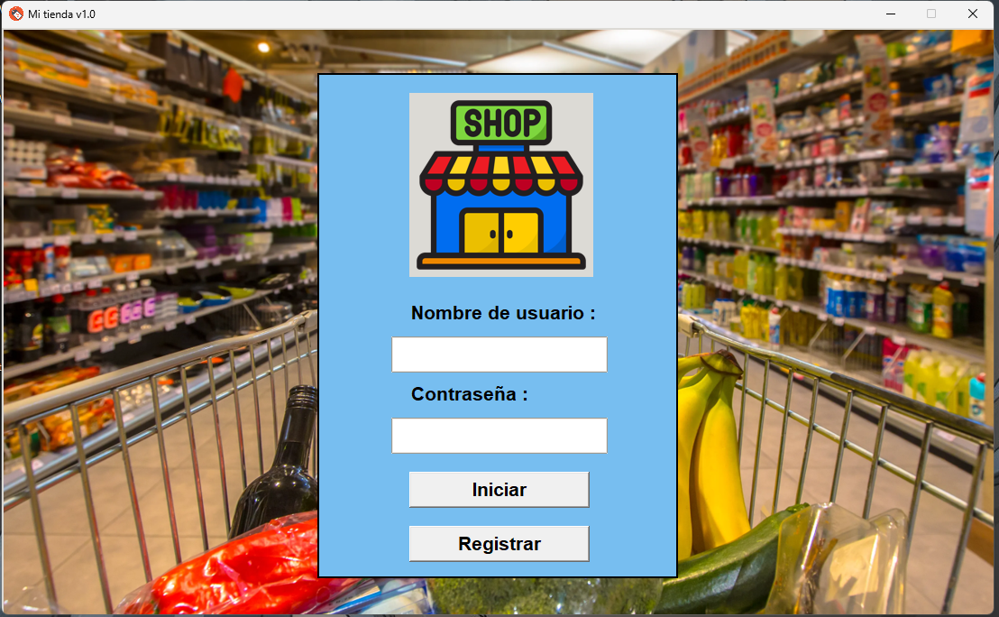
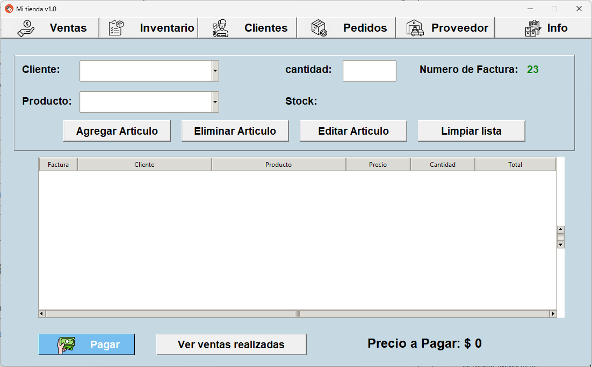

# Caja Registradora Python






## Descripción
Este proyecto es una aplicación de caja registradora desarrollada en Python utilizando la biblioteca Tkinter. Permite gestionar el inventario, realizar ventas y generar reportes.

## Instalación
1. **Clonar el repositorio:**
   ```bash
   git clone [https://github.com/jhonshua/Python-Tkinter.git]


Estructura de carpetas propuesta:
   
PUNTO DE VENTA

├── data/                                                
│   └── env/  # Entorno virtual                                            
├── media/                             
│   ├── icons/                                                                      
│   └── img/                                 
│       └── img_productos/                                  
│       └── fondo.png                             
├── modulos/                                 
│   ├── login/                                     
│   ├── clientes.py                                                        
│   ├── informacion.py                                         
│   ├── inventario.py                                                   
│   ├── pedidos.py                                                            
│   ├── proveedor.py                                                       
│   └── ventas.py                                                                   
├── .gitignore                                                                         
├── container.py                                                                                
├── index.py                                                                                       
├── LICENSE                                                                                     
├── manager.py                                                                                     
├── readme.md                                                                                      
├── requirements.txt                                                                               
              